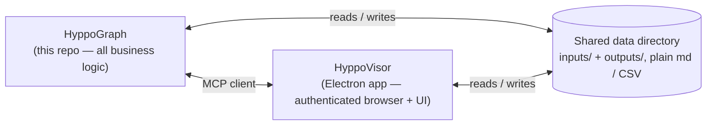

# HyppoGraph

**The orchestrator that turns a stream of job descriptions into a ranked,
decision-ready shortlist.**

HyppoGraph is a deterministic workflow built on the
[Claude Agent SDK](https://github.com/anthropics/claude-agent-sdk-typescript).
Plain JS code drives a fixed pipeline — intake, normalize, hard-filter, score
with evidence, warm-path enrichment, tier, generate deliverables, feedback loop —
and a model is called only *inside* the steps that need judgment. No free-roaming
agent decides what to do next: the code decides, the model does the cognitive
piece of each step.

Every good match arrives with a fit score, a gap analysis, logistics fit
(salary / location / arrangement), warm-path options from your merged connections
store, a tailored CV, and a concrete next-action list — so your own time goes only
to the last mile: applying, connecting, deciding. Nothing is ever submitted or
sent automatically.

## Where it sits



- **HyppoGraph owns all judgment.** Understanding a job description, a career
  fact, or a connection's usefulness happens here. It has no UI and no direct
  access to any logged-in session.
- **[HyppoVisor](https://github.com/juliaviluhina/hyppovisor)** owns everything
  that needs a human-authenticated browser or a human's screen. HyppoGraph
  connects to it as an MCP client for every page read or navigation. HyppoVisor
  does not depend on HyppoGraph — it is a general authenticated-session MCP
  server that HyppoGraph happens to be the first consumer of.
- The two share one **local data directory** as their only persistent state —
  no database, no services. Both read and write it directly.

## Model usage

Volume work cheap, judgment work strong:

| Step | Model tier |
|---|---|
| Bulk extraction, normalization, dedup, company-name matching | fast (Haiku-class) |
| Scoring with cited evidence | mid |
| Tier-1 deliverables — CV tailoring, decision memos, outreach drafts | top (Opus-class, higher effort) |

## Data directory

HyppoGraph takes the data-directory path as local config (`HYPPO_DATA_DIR` or
equivalent). It is **not** part of this repo. Point it at any local folder that
follows the structure below:

```
<data-dir>/
├── provenance-log.md         # every addition anywhere below — what/how/why, append-only
├── inputs/                   # everything HyppoGraph reads to decide
│   ├── candidate-profile.md
│   ├── directions/           # one prepared-CV file per direction + shared CV materials
│   ├── priorities.md         # priorities, benchmarks incl. salary, settings, scoring-weight prose
│   ├── boards.md             # tracked job-board list + collection depth
│   ├── connections/          # merged LinkedIn export + personal contacts, with attributes
│   └── applications.md       # applications tracker — dedup + channel-exclusivity source
└── outputs/                  # everything HyppoGraph produces, rendered by HyppoVisor's dashboard
    ├── job-records/          # normalized, scored, tiered Job Records
    ├── queue.md              # the ranked review queue
    ├── deliverables/         # tailored CVs + diff notes, outreach drafts
    └── outcomes.md           # the feedback-loop log
```

Personal data — candidate profile, salary numbers, applications, connections —
stays private, in a folder either app is merely pointed at.

## Spec-driven development

This repo uses [Spec Kit](https://github.com/github/spec-kit). Design intent
lives in [`.specify/memory/constitution.md`](.specify/memory/constitution.md);
features are specced under `specs/` via the `/speckit-*` skills.

## License

[Apache-2.0](LICENSE) — free for any use including commercial; keep `LICENSE`
and `NOTICE` with any copy. The MCP contract with HyppoVisor is open to
implement against.
