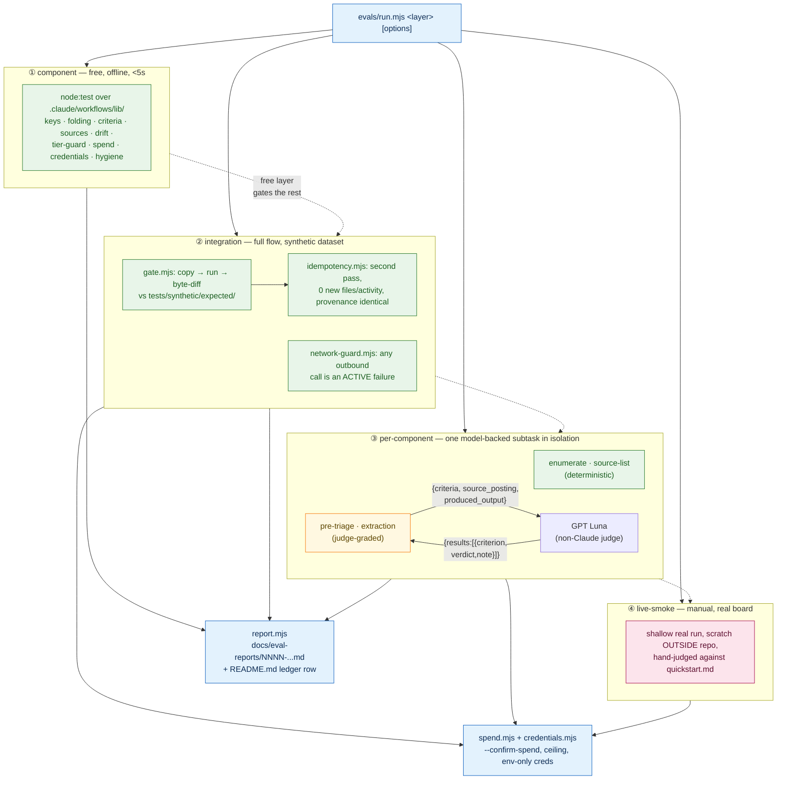

# Eval harness

Feature [`003-eval-harness`](../specs/003-eval-harness/) — a layered, judgment-quality eval system
for the intake-normalize pipeline. Complements [Testing approach](./testing.md)'s unit/integration
tiers with the one thing they can't cover: whether a model-backed step's *judgment* (not just its
wiring) is actually correct, using a non-Claude judge where a human rubric can't be reduced to
regex. Design docs: [`spec.md`](../specs/003-eval-harness/spec.md),
[`plan.md`](../specs/003-eval-harness/plan.md),
[`eval-strategy.md`](../specs/003-eval-harness/eval-strategy.md) (the bug-history rationale).

## Purpose

Five real Phase A bugs in the intake-normalize pipeline were all findable in seconds at a cheap
layer — a wobbly dedup key, a company-suffix rename, a silently-zeroed enumeration step — but the
only instrument available at the time was a full ~25-minute, ~90-`agent()`-call workflow run. This
harness exists so a defect is caught at the **cheapest layer that can express it**: free pure-logic
checks first, a deterministic full-flow gate next, judgment-quality checks last (they're the only
layer that costs anything, and even that's currently $0 — see [Judge settings](#llm-as-a-judge-settings)).

## Structure — four layers + two cross-cutting concerns



| Layer | Scope token(s) | Cost | Catches |
|---|---|---|---|
| ① component | `component` | $0, no network | Pure-logic regressions (dedup keys, slugging, completeness rule), inlined-copy drift, tier/spend/credential misconfiguration |
| ② integration | `integration`, `integration-idem` | $0 (`mock`/`workflow-tool` substrate) | Wiring bugs across the full collect→triage→normalize flow; non-idempotent re-runs; hermeticity breaches |
| ③ per-component | `enumerate`, `pre-triage`, `extraction`, `source-list` | $0 today (judge calls measured at $0 on the current model) | A subtask silently losing a capability; judgment-quality defects (unfaithful extraction, unsound triage reasoning) |
| ④ live-smoke | `live-smoke` | plan-billed, `--confirm-spend` required | Sanity of a real run against a real board — hand-judged, not automated |

## Solution parts (file map)

```text
evals/
├── run.mjs                     # single CLI entry point — dispatch, spend gate, report writing
├── component/                  # ① node:test files (free layer)
├── integration/
│   ├── gate.mjs                # copy → run → byte-compare vs tests/synthetic/expected/
│   ├── idempotency.mjs         # second-pass invariants
│   ├── mock-pipeline.mjs       # canned-judgment reimplementation of the workflow's control flow
│   └── run-layer.mjs           # wires gate+idempotency+network-guard into run.mjs
├── per-component/
│   ├── {enumerate,pre-triage,extraction,source-list}.mjs
│   ├── fixtures/*.json         # per-subtask case tables (input, expected, judge type, stability)
│   ├── rubrics/*.md            # the two permitted judge rubric types
│   ├── lib/run-subtask.mjs     # shared fixture-table driver
│   └── run-layer.mjs           # wires all four into run.mjs, gated behind spend+credentials
└── lib/
    ├── mock-agent.mjs          # deterministic fixture-canned agent() stand-in
    ├── judge.mjs               # the non-Claude judge client
    ├── spend.mjs                # --confirm-spend gate + ceiling tracker
    ├── credentials.mjs         # environment-only credential read
    ├── network-guard.mjs       # active outbound-call failure
    └── report.mjs              # assemble + write a dated report, append the ledger row

.claude/workflows/lib/          # source-of-truth modules the evals import directly
├── intake-core.mjs             # pure helpers (workflow carries a drift-guarded inlined copy)
└── prompts.mjs                 # the exact agent() prompt text per subtask

tests/synthetic/                # hermetic ~9-posting dataset + locked expected-output tree
docs/eval-reports/              # NNNN-YYYY-MM-DD-<scope>.md + README.md spend ledger
```

## Tools used

- **Plain Node ≥ 20** — `node:test`, `node:assert`, `node:fs`, `node:child_process`, global `fetch`.
  No third-party test framework, no build step (`package.json` carries zero runtime dependencies).
- **Claude Code `Workflow` tool** — the default (`workflow-tool`) substrate for the model-backed
  layers; subscription-billed, ~$0 to the user. Its `agent()` global only exists inside a Claude Code
  session, so `evals/run.mjs` (plain Node) cannot drive it directly — a human/Claude session runs the
  real workflow first, then the harness compares the result.
- **`mock` substrate** (`evals/lib/mock-agent.mjs`, `evals/integration/mock-pipeline.mjs`) —
  deterministic, canned-judgment stand-ins for every `agent()` call. Zero cost, zero network. This is
  how the harness is developed and exercised end to end without spending anything.
- **A non-Claude judge model** (see below) reached with a thin `fetch` wrapper — the only place this
  harness makes a real, non-mocked external call.
- **`git`** — `evals/component/credential-hygiene.test.mjs` shells out to `git ls-files` to scan every
  tracked file for a leaked credential shape.

## LLM-as-a-judge settings

| Setting | Value | Why |
|---|---|---|
| Model | `gpt-5.6-luna` ("GPT Luna") | **Deliberately non-Claude** — a Claude judge grading Claude output has a self-preference bias; this also keeps judge spend off the Anthropic meter (research D5) |
| Endpoint | `HYPPO_JUDGE_BASE_URL` = `https://opencode.ai/zen/go/v1/responses` (OpenAI *Responses* API shape, not Chat Completions) | Verified live 2026-09-14 |
| Reasoning effort | `HYPPO_JUDGE_EFFORT=low` | Verified sufficient for pass/fail rubric grading at this cost tier |
| Session header | `x-opencode-session: <stable per-run id>` | Required by the endpoint for routing/caching (else HTTP 400 `MissingSessionID`) — **not** a credential, exempt from the environment-only secrecy rule (FR-010b) |
| Credential | `HYPPO_JUDGE_API_KEY` | Read from the environment only, never logged, never in a report — transport header only |
| Permitted rubric types | `extraction-faithfulness`, `pre-triage-reason` — **only these two** (FR-010a) | Everything else stays deterministic (regex/schema/byte-equality); the judge covers only the genuinely fuzzy remainder |
| Request shape | `{ criteria: string[], source_posting: string, produced_output: object }` | `evals/lib/judge.mjs`'s `buildJudgePrompt()` renders this into a single prompt instructing strict-JSON output |
| Response shape | `{ results: [{ criterion, verdict: "pass"\|"fail", note }] }` | A response missing a criterion or returning anything but pass/fail fails the case with "judge response malformed" — never a hard error |
| Measured cost so far | **$0** on every live call made while building this feature | Recorded per-run in `docs/eval-reports/` |

Rubric files live at `evals/per-component/rubrics/<type>.md` (`## criteria` numbered list +
`## pass_rule`, default `all`). `evals/lib/judge.mjs` refuses to run any rubric whose `type` isn't
one of the two permitted values.

## How to run

```bash
npm test                                          # → component layer, $0, always safe

node evals/run.mjs integration --substrate mock   # full flow vs the synthetic dataset, $0

node evals/run.mjs enumerate --substrate mock     # deterministic per-component eval, $0
node evals/run.mjs source-list --substrate mock   # deterministic per-component eval, $0

# judge-graded layers need the judge credential AND --confirm-spend (contracts/evals-cli.md's
# step order: the confirm-spend gate runs BEFORE the credential check)
node evals/run.mjs pre-triage --substrate mock --confirm-spend
node evals/run.mjs extraction --substrate mock --confirm-spend

# real workflow-tool run (default substrate) — needs a human/Claude session to drive the
# Workflow tool first; the CLI prints exact setup instructions if nothing has run yet
node evals/run.mjs integration

# manual, real board, real spend — scratch MUST be outside the repo
node evals/run.mjs live-smoke --scratch /tmp/hyppo-live --confirm-spend

# refused everywhere until the FR-023 milestone (T049) is built + approved
node evals/run.mjs integration --substrate metered   # → exit 2
```

| Option | Effect |
|---|---|
| `--substrate <workflow-tool\|mock\|metered>` | Default `workflow-tool`. `mock` is the $0 automated path. `metered` is refused (exit 2) until the gated standalone SDK substrate exists. |
| `--confirm-spend` | Required for any run that would incur (judge or metered) cost; absent → prints an estimate and exits 0, no paid call. |
| `--ceiling <dollars>` | Per-run spend ceiling, checked before each metered call. |
| `--scratch <dir>` | Where the dataset is copied / the pipeline writes. Required, and must be outside the repo, for `live-smoke`. |
| `--no-report` | Skip report writing — local iteration only; a real run always leaves one. |

Exit codes: `0` pass (or a no-op estimate print) · `1` one or more cases failed · `2` precondition
failure (missing credential, unbuilt substrate, setup required) · `3` spend ceiling hit mid-run.

## Input and output

| Layer | Input | Output |
|---|---|---|
| component | Nothing external — inline cases + static source/repo checks | Console TAP-style summary; report + ledger row |
| integration | `tests/synthetic/data-dir/` (copied to `--scratch`) | `--scratch`'s populated `outputs/` tree + `provenance-log.md`, diffed against `tests/synthetic/expected/`; report + ledger row |
| per-component | `evals/per-component/fixtures/<subtask>.json` (case `input`, canned `mockResult`, deterministic `expected`, optional `judge` rubric) | Per-case pass/fail, judge verdicts + notes for judge-graded cases; report + ledger row |
| live-smoke | A real board search you're signed into via HyppoVisor | Job Records / provenance / summary in a scratch dir outside the repo — judged by hand, no automated report |

Every non-live report follows one fixed shape
([contracts/eval-report.md](../specs/003-eval-harness/contracts/eval-report.md)): `Methodology` (layer,
judge, substrate) → `Under test` (commit, model IDs, fixture, run id) → `Results` table (+ diffs on
failure) → `Cost` (tokens, dollar figure) → `Findings`. `docs/eval-reports/README.md` is the running
index and doubles as the spend ledger — see [its own "how to read this"](./eval-reports/README.md).

## Status

Phases 1–7 (all free/`mock`-substrate layers) are built and green — see the ledger for the latest
run of each. The one deliberately-untouched piece is **T049**, the standalone
`@anthropic-ai/claude-agent-sdk` metered substrate: it is the single point where this feature would
commit to real credit spend (FR-020), and it stays gated on your explicit go-ahead. Until then,
`--substrate metered` is refused for every layer, and `package.json` carries no SDK dependency.
