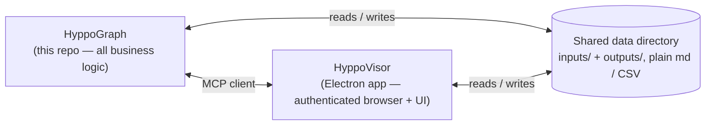

# Solution design

## Where it sits



- **HyppoGraph owns all judgment.** Understanding a job description, a career fact,
  or a connection's usefulness happens here. It has no UI and no direct access to any
  logged-in session.
- **[HyppoVisor](https://github.com/juliaviluhina/hyppovisor)** owns everything that
  needs a human-authenticated browser or a human's screen. HyppoGraph connects to it
  as an MCP client for every page read or navigation. HyppoVisor does not depend on
  HyppoGraph — it is a general authenticated-session MCP server that HyppoGraph
  happens to be the first consumer of.
- The two share one **local data directory** as their only persistent state — no
  database, no services. Both read and write it directly. See
  [Constitution → Architectural Boundaries](../.specify/memory/constitution.md#architectural-boundaries).

## The pipeline

Eight fixed stages, run in order by plain code — a model is called only inside a
stage, for the judgment that stage needs (why: [`why.md`](./why.md)):

`intake → normalize → hard-filter → score with evidence → warm-path enrichment →
tier → generate deliverables → feedback loop`

Two stage-groups are implemented and live today, each as a
[Claude Code dynamic workflow](https://code.claude.com/docs/en/workflows) — a
prototyping substrate, cheap to iterate in a session, that gets ported to the Claude
Agent SDK once proven (see [Status](#status) below):

| Stage-group | Workflow | Steps | Spec |
|---|---|---|---|
| intake → normalize | `.claude/workflows/intake-normalize.js` | collect → pre-triage → normalize | [`specs/001-intake-normalize-pipeline/`](../specs/001-intake-normalize-pipeline/) |
| hard-filter → score | `.claude/workflows/fit-screen.js` | verify → score | [`specs/004-retrieval-fit-screen-rework/`](../specs/004-retrieval-fit-screen-rework/) |

Full step-by-step behavior, inputs, and outputs for both live workflows:
[`docs/pipeline.md`](./pipeline.md). The remaining stages (warm-path enrichment
through feedback loop) are not yet built.

## Model usage

Volume work cheap, judgment work strong — every model call declares a tier, and the
tier must match the work
([Principle II](../.specify/memory/constitution.md#ii-right-tier-model-usage)):

| Step | Model tier |
|---|---|
| Bulk extraction, normalization, dedup, company-name matching | fast (Haiku-class) |
| Scoring with cited evidence | mid |
| Tier-1 deliverables — CV tailoring, decision memos, outreach drafts | top (Opus-class, higher effort) |

## The data directory

HyppoGraph takes the data-directory path as local config (`HYPPO_DATA_DIR` or
equivalent). It is **not** part of this repo — personal data (candidate profile,
salary numbers, applications, connections) stays in a folder either app is merely
pointed at ([Principle V](../.specify/memory/constitution.md#v-local-files-are-the-only-state)).

```
<data-dir>/
├── provenance-log.md         # every addition anywhere below — what/how/why, append-only
├── inputs/                   # everything HyppoGraph reads to decide
│   ├── candidate-profile.md
│   ├── directions/           # one prepared-CV file per direction + shared CV materials
│   ├── priorities.md         # priorities, benchmarks incl. salary, settings, scoring-weight prose
│   ├── boards.md              # tracked job-board list + collection depth
│   ├── connections/          # merged LinkedIn export + personal contacts, with attributes
│   └── applications.md       # applications tracker — dedup + channel-exclusivity source
└── outputs/                  # everything HyppoGraph produces, rendered by HyppoVisor's dashboard
    ├── job-records/          # normalized, scored, tiered Job Records
    ├── queue.md              # the ranked review queue
    ├── deliverables/         # tailored CVs + diff notes, outreach drafts
    └── outcomes.md           # the feedback-loop log
```

## Spec-driven development

This repo uses [Spec Kit](https://github.com/github/spec-kit). Design intent lives in
[`.specify/memory/constitution.md`](../.specify/memory/constitution.md); every feature
is specced under [`specs/`](../specs/) via the `/speckit-*` skills before
implementation. See [Contributing](./contributing.md) for the workflow.

## Status

Every live stage-group is a **Phase A prototype**: validation is manual (quickstart
scenarios by hand), run as a Claude Code dynamic workflow. Porting to the Claude
Agent SDK, automated `vitest` + CI coverage, hard idempotency guarantees, and
statistical success-criteria measurement are Phase B, gated on each feature's Phase A
exit review. See each spec's `tasks.md` for the exact gate.
