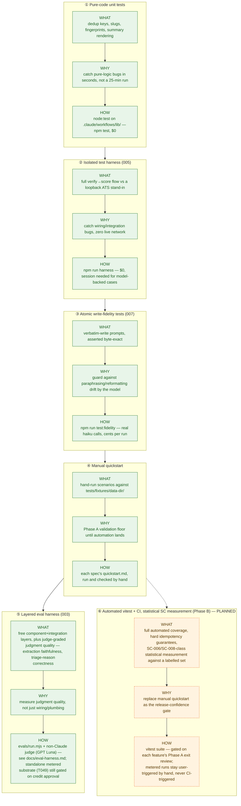

# Testing approach

Three independent tiers, each catching a different class of defect at the cheapest
layer that can express it — cheapest and fastest first. The split came out of a
concrete post-mortem: five real Phase A bugs were all findable in seconds at a low
tier, but the only instrument available at the time was a full ~25-minute,
~89-`agent()`-call workflow run. Full reasoning and bug history:
[`specs/003-eval-harness/eval-strategy.md`](../specs/003-eval-harness/eval-strategy.md).

## Layers, top to bottom: cheapest/most-frequent → priciest/rarest

Solid boxes are live today; dashed boxes are specced but not built yet — see each
layer's section below for status and the spec that owns it.

| Tier | What it covers | Cost | Command |
|---|---|---|---|
| Pure-code unit tests | Dedup keys, slugging, fingerprints, summary rendering — every helper factored out of the workflows into `.claude/workflows/lib/` | $0, milliseconds | `npm test` |
| Isolated test harness (005) | The full verify-then-score flow against a loopback ATS stand-in — no live network, no real postings | $0 (subscription-billed session time) | `npm run harness` |
| Atomic write-fidelity tests (007) | Byte-exact verification of the verbatim-write prompts in both live workflows — one real fast-tier model call per test | cents per run | `npm run test:fidelity` |

## Pure-code unit tests

Stdlib Node (`node:test` + `node:assert`), zero dependencies. Covers the pure
functions a workflow's control flow depends on — dedup-key assembly, company-name
canonicalization, criteria fingerprints — factored into plain ESM under
`.claude/workflows/lib/` so they're both `import`-able by tests and inlined (with a
byte-identity guard test) into the sandboxed workflow script, which cannot `import`
from outside its own body.

## Isolated test harness

`tests/harness/` — a zero-live-dependency suite for `.claude/workflows/fit-screen.js`'s
verify-then-score flow, built around a loopback ATS stand-in
(Greenhouse/Lever/Ashby paths, live/closed/malformed/error/flapping scenarios). 57
cases, all green. Model-backed cases need a Claude Code session (the workflow only
executes in-session); node-only cases run standalone. See
[`tests/harness/README.md`](../tests/harness/README.md) for the managed-service
workflow, session-backed run rails, and a troubleshooting table. Design:
[`specs/005-isolated-test-harness/`](../specs/005-isolated-test-harness/).

Known constraint: `hyppo-verify` (WebFetch-only) cannot reach a plain-HTTP fixture
service — WebFetch upgrades `http://` to `https://` unconditionally. Session runs
show ATS records as `unresolvable` by design; the worker's real wire behavior is
proven separately against `tests/fixtures/live/`.

## Atomic write-fidelity tests

`tests/fidelity/` — one real fast-tier `agent()` call per test, asserting the
verbatim-write prompts in both workflows reproduce their input byte-for-byte, with no
paraphrasing or reformatting drift. No fixture service, no scratch-copied data
directory, no other agent calls per test (spec 007's independent-test requirement).
See [`tests/fidelity/README.md`](../tests/fidelity/README.md) and
[`specs/007-write-fidelity-guardrails/`](../specs/007-write-fidelity-guardrails/).

## Eval harness and evidence reports

`evals/` — a four-layer harness (component, integration+idempotency, per-component,
live-smoke) that complements the isolated harness with **judgment-quality** checks: a
non-Claude judge (GPT Luna) grades extraction faithfulness and triage-reason
soundness against explicit rubrics, on top of the deterministic checks the other
tiers already cover. Every run — free or metered — leaves a dated report in
[`docs/eval-reports/`](./eval-reports/README.md), which doubles as the **spend
ledger** so cost stays auditable against the account's actual recorded spend. No run
is triggered automatically — no CI, no push/PR hooks; every run is started by hand.
Full design, the judge's exact settings, how to run each layer, and input/output per
layer: [Eval harness](./eval-harness.md).

## Q&A: models and credentials

**What model runs `npm run harness`?** No model at all for node-only cases (pure
loopback HTTP + assertions). Model-backed cases need to be driven inside a Claude
Code session, and then use whatever model the live workflow itself declares — `haiku`
for every step except `hyppo-score`, which is `sonnet`
([Solution design → Model usage](./solution-design.md#model-usage)).

**What model runs `npm run test:fidelity`, and via what credentials?** Each test
shells out to `claude -p` (`tests/fidelity/support/run-workflow.mjs`), which drives a
real `Workflow`/`agent()` call in a throwaway Claude Code session. The model is
hardcoded to `haiku` in each `*.workflow.js` file (e.g.
`tests/fidelity/write-evaluation.workflow.js:100`). Credentials are whatever the
`claude` CLI on your machine is already authenticated with — the same login your
interactive session uses, subscription-billed, **not** an API key from `.env`. The
subprocess runs with `--dangerously-skip-permissions` so it can write its temp output
file non-interactively; that's a permissions bypass, not a separate credential.

**Gotcha:** running `npm run test:fidelity` from *inside* an agent session (rather
than your own terminal) trips a classifier that blocks spawning
`claude -p --dangerously-skip-permissions` outright ("Create Unsafe Agents") — the
child process exits 0 but stdout is just the denial message, so no real model call
happens. Run this suite directly from your terminal.

**Where do `HYPPO_JUDGE_API_KEY` / `HYPPO_JUDGE_BASE_URL` / `HYPPO_JUDGE_MODEL` /
`HYPPO_JUDGE_EFFORT` fit in?** They configure feature 003's non-Claude judge (GPT
Luna, reached via `evals/lib/judge.mjs`), used for the two judge-graded
per-component eval cases (`pre-triage`, `extraction`). Verified live — see
[Eval harness → LLM-as-a-judge settings](./eval-harness.md#llm-as-a-judge-settings)
for the exact request/response shape and why `x-opencode-session` is required but
not a credential.

## Manual validation

Both live workflows still carry a manual **quickstart**: hand-run scenarios against
`tests/fixtures/data-dir/`, checked against the expected outputs in each spec's
`quickstart.md`. This is the Phase A validation floor until each feature's Phase B
slice lands automated `vitest` + CI coverage and the statistical success-criteria
measurements — see [Solution design → Status](./solution-design.md#status).
