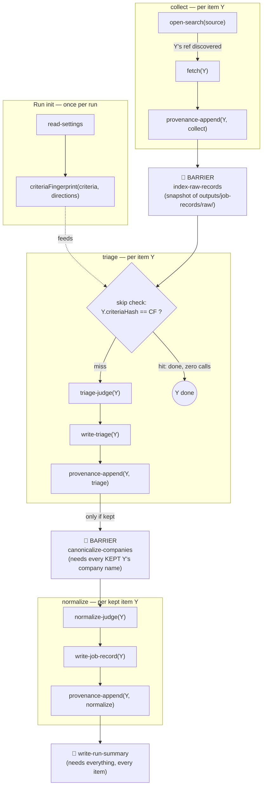
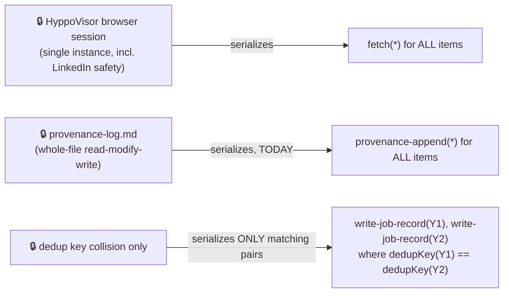

# Issue: `intake-normalize.js` is serial end-to-end when only part of it needs to be

**Status:** Idea, not yet spec'd — surfaced live while diagnosing why a 15-posting collect run
against `jobs.ashbyhq.com/Coder` took ~27 minutes for `collect` alone, with `triage`/`normalize`
projected to add another 30-60 minutes.

**Scope:** `.claude/workflows/intake-normalize.js` (`collect`/`triage`/`normalize` phases), the
`hyppo-collect-list`/`hyppo-collect-fetch` subagents, and (for the API-collection idea)
`buildAtsApiUrl`'s board-recognition logic, already shared conceptually with
`specs/004-retrieval-fit-screen-rework/research.md` R5.

## Problem / opportunity

Timed a real run via the per-agent logs (`journal.jsonl` + `agent-*.jsonl` under the workflow's
transcript dir). Two distinct, separable inefficiencies showed up:

### 1. Post-retrieval phases are serial when only *some* of their work needs to be

`intake-normalize.js` runs `collect`, `triage`, and `normalize` as three **serial `for` loops**
(explicit comments at lines 323, 572, 659 — "Serial `for` loop, not pipeline()"). The stated reason
(line 572) is that `appendProvenance` (line 1182) does a **Read-the-whole-file /
Write-the-whole-file-back** against the single shared `provenance-log.md` on every call — real
concurrent callers would race and drop lines. `normalize`'s per-record write also merges into a
shared `outputs/job-records/<key>.md` when two raw records dedupe to the same key (line 659) — a
genuine but narrow collision case (only colliding pairs, not the whole batch).

Neither reason requires the *judgment* calls themselves to be serial:
- `triage`'s `hyppo-judge` call and `normalize`'s field-extraction judge call each read only
  already-fetched local text (the raw record body, evidence/criteria) and write nothing shared —
  nothing about them touches `provenance-log.md` or another record's file.
- The provenance race is a consequence of *how* `appendProvenance` appends (whole-file
  read-modify-write, once per record, 15 times per run at ~40-55s each per the timing data), not a
  requirement that every record be fully serialized. Collapsing a phase's provenance lines into
  **one write per phase** (the same batched-write pattern `writeSummary` already uses) removes the
  race by construction — there is exactly one writer, called once, not N racing writers.

The comment also claims an empirical finding — "the FAST writer drops or misroutes front-matter
writes under load" — which reads as a real prior observation, not just a theoretical race. That
needs re-verification before trusting concurrent per-record file writes (even to distinct files),
separately from the provenance-race argument.

### 2. HyppoVisor is required for authenticated/JS-heavy boards, but not necessarily for ATS-API-backed ones

Feature 001's own `research.md` (R3, "Scrape raw HTTP without HyppoVisor — rejected: job boards
need the user's authenticated session") is why `collect` drives HyppoVisor's browser for every
tracked board today. That reasoning holds for LinkedIn and any board without a public API.

It does **not** obviously hold for Greenhouse/Lever/Ashby-hosted boards. `fit-screen.js`'s
`hyppo-verify` step already treats those three ATS vendors' posting APIs as public and
unauthenticated — plain `WebFetch` GETs to `boards-api.greenhouse.io`, `api.lever.co`,
`api.ashbyhq.com` (004's `research.md` R5), no browser, no session. Those same vendors also expose
a **board-level listing endpoint** that returns every open posting (often with full description
content) in one response — e.g. Ashby's `posting-api/job-board/<org>` without a job id. If that
holds for a given board's org slug, `collect` could skip HyppoVisor entirely for that source: one
or a few stateless WebFetch calls instead of one `hyppo-collect-list` browser call plus one
`hyppo-collect-fetch` browser call *per posting*. Stateless GETs are also trivially safe to run
concurrently (subject to being a polite citizen of that public API — some pacing still applies),
unlike HyppoVisor's single shared browser/tab.

This is unverified — needs a real check against each board's actual API shape (does it paginate,
does it include full content or just metadata, is there a rate limit) — and only applies to
Greenhouse/Lever/Ashby-hosted boards specifically. Generic company career pages and aggregators
without a public JSON API (himalayas, weworkremotely, dice, hiring.cafe, remoterocketship, in the
current `trackedBoards`) stay HyppoVisor-only, no change.

### LinkedIn is explicitly excluded from every optimization in this issue

LinkedIn is not just "stays on HyppoVisor, no change" — it must be treated as **off-limits for any
of the parallelism or API-shortcut ideas above**, including ones that might seem to apply to it
generically (e.g. "run independent per-source fetches concurrently"). LinkedIn actively detects
automated/bot-like browsing patterns on a real logged-in account and can suspend or restrict it —
that's a real-account risk (the user's own LinkedIn account, via HyppoVisor's session), not just a
data-quality or reliability concern like the rest of this issue. Three of the current
`trackedBoards` entries are LinkedIn searches; whatever comes out of this issue must leave their
collection exactly as serial and paced as it is today (or more conservative), never faster or more
concurrent. If anything, LinkedIn pacing is a candidate for its own, stricter `HYPPO_PACING_MS`-like
setting in a future issue — not something to touch here.

### 3. Chunk-based pipelining across stages, not just within one

A further refinement on top of #1: instead of running `collect` to completion for *all* postings
before `triage` starts at all (and same for `triage` → `normalize`), batch postings into small
chunks (e.g. 3-5) and let a chunk's `triage`/`normalize` work run **concurrently with the next
chunk's `collect`**. Retrieval stays exactly as serial and one-source-at-a-time as it is today
(preserving the HyppoVisor/LinkedIn constraints untouched — see below) — the overlap is *between*
stages, not within `collect` itself. Wall-clock then tends toward
`max(total collect time, total triage+normalize time)` plus one chunk's fill/drain latency, instead
of the sum of all three phases run back-to-back.

Two concrete things found while scoping this:

- **The built-in `pipeline()` helper can't express this directly** — `intake-normalize.js`'s own
  comment (line 323) already notes "the real `pipeline()` has no concurrency option." It runs
  every item through all stages at once, all-or-nothing; there's no "N in flight, staggered start"
  mode. Getting the chunk-based overlap the user describes means hand-rolling it with plain
  async/Promise orchestration in the script body (fire a chunk's downstream-stage promises without
  awaiting them immediately, keep collecting the next chunk, reconcile later) rather than reaching
  for `pipeline()`/`parallel()` as-is — both are documented as barriers, not bounded queues.
- **`normalize`'s company-canonicalization step is a whole-batch operation today** (the
  `canonicalise-companies` call at line ~671 reads every kept record's company name across the
  *entire* run in one call before the per-record loop starts). Chunking cleanly through `collect` →
  `triage` is straightforward since those are fully per-record already; carrying the overlap into
  `normalize` needs that canonicalization step to become per-chunk-incremental (it already reads
  `companies.md` + existing Job Records and merges, so calling it once per chunk instead of once per
  run is plausible) or `normalize` stays a single final stage after every chunk reaches `triage`,
  which still captures most of the win (collect/triage overlap) without touching the trickier part.

**LinkedIn stays untouched by this idea too**: chunking changes *when* downstream stages run
relative to `collect`, never how `collect` itself paces or parallelizes fetches. LinkedIn's fetches
stay exactly as serial as every other source's, and the exclusion above still applies undiminished.

## Dependency map (for planning the spec)

Brainstormed 2026-09-20 while scoping this against issue 006. Treat one item `Y` as flowing through
the pipeline; cross-item constraints are separate from `Y`'s own chain.

### Per-item stage chain (real, must-keep dependencies)

Real per-item dependencies (can't reorder without breaking correctness):
`fetch(Y)` → `triage-judge(Y)` → `write-triage(Y)` → `normalize-judge(Y)` → `write-job-record(Y)`.
Each needs the previous step's output for *that same item*.

**The two barriers, and which is real vs. relaxable:**
- `index-raw-records` currently waits for *all* of `collect` before *any* item enters `triage` — but
  it's just a directory listing; nothing stops it from running against whatever's on disk after each
  chunk. **Artificial barrier** — exactly what §3 above proposes relaxing.
- `canonicalize-companies` needs every kept item's company name to build one coherent map in a
  single pass. **Real for a single-shot design**, but relaxable to per-chunk-incremental (it already
  reads+merges against existing `companies.md` today).

### Cross-item constraints (not about Y's own chain — about what can't overlap with Y)

- **L1 (HyppoVisor)**: real, and for LinkedIn specifically non-negotiable — never relax this one.
- **L2 (provenance)**: purely an artifact of *how* it appends today. Batch it into one write per
  phase/chunk (§ "Low-risk" below) and this constraint disappears — it stops being "must serialize"
  and becomes "only happens once."
- **L3 (dedup collision)**: real, but narrow — only the (rare) pairs sharing a dedup key need to
  serialize; everything else is independent.

### Issue 006 is a prerequisite, not a parallel concern

The `SKIP` decision above is only trustworthy if `CF` (the fingerprint) is **stable across runs**
for unchanged config — issue 006 found that broken (an LLM-transcribed settings read can drift the
hash between runs with no config change at all). Any chunking/scheduling scheme here needs to
correctly tell "already done" from "new" to get its efficiency gain at all — fix 006 first, or a
chunked/parallel version of this pipeline just re-does stale work faster and in a more confusing
order, instead of not doing it at all.

## Proposed directions, by category

**Low-risk, no architecture change (do first):**
- Batch `appendProvenance` into one write per phase instead of one agent call per record —
  directly removes both the race justification for seriality *and* most of the per-record wall-clock
  cost (each call was independently costing ~40-55s in the timed run, purely for a one-line append).
  **DONE, 2026-09-20.** `intake-normalize.js` now queues every provenance line in memory
  (`queueProvenance`) and flushes each phase's queue in one agent() call (`flushProvenance`) instead
  of one call per record. Verified live alongside the 006 fix: a two-pass run against the 14-record
  test fixture showed zero provenance calls in a phase whose queue stayed empty (triage, on the
  idempotent second pass) and exactly one batched call for normalize's 7 merges (vs. 7 separate calls
  previously). See issue 006's Status section for the full verification writeup.

**Needs verification before building:**
- Confirm empirically whether concurrent per-record `hyppo-judge` (triage) and normalize
  field-extraction calls are actually safe/reliable at the fast tier under load — the code comment's
  "drops or misroutes writes" claim may or may not extend to read-only judgment calls; test before
  assuming `pipeline()` is a drop-in replacement for the triage/normalize `for` loops.
- Check each of Greenhouse/Lever/Ashby's actual public board-listing API shape (pagination limits,
  full-content availability, any rate limiting) against a real board before designing the
  WebFetch-based collect path.

**Architecture change (would need `speckit-specify`/`plan`):**
- Split `triage`/`normalize` into a parallel judgment stage (`pipeline()`/`parallel()` over
  independent per-record judge calls) followed by a serial-but-batched write stage (one
  front-matter-writing pass + one provenance write per phase), only keeping true collision cases
  (same dedup key in `normalize`) serialized against each other.
- Chunk-based pipelining across stages (§3 above): hand-rolled bounded-concurrency overlap between
  one chunk's `triage`/`normalize` and the next chunk's `collect`, with `normalize`'s
  company-canonicalization step made per-chunk-incremental (or kept as a single final stage,
  narrowing the win to collect/triage overlap only, as a lower-risk first cut).
- For boards recognized as Greenhouse/Lever/Ashby-hosted (extending `buildAtsApiUrl`'s
  board-recognition logic to the board-*listing* level, not just per-posting), add a WebFetch-based
  collect path that bypasses HyppoVisor and `hyppo-collect-list`/`hyppo-collect-fetch` for those
  sources only; every other board keeps the current HyppoVisor path unchanged.

## Recommended action

Start with the batched-provenance-write fix — it's bug-fix-sized, needs no spec, and independently
cuts a large fraction of the observed per-record wall-clock cost regardless of what happens with the
other two ideas. Take the judgment-parallelism split and the ATS-API collect path through
`speckit-specify`/`plan` given they touch this feature's Constitution Check (Principle I's control
flow guarantees, and Principle IV's per-agent tool policy) — the ATS-API path also needs its
verification step (real API shape check) done first, before design. Whatever spec comes out of this
must carry the LinkedIn exclusion above forward explicitly (e.g. a Constitution Check line or an
FR-level "never" for LinkedIn sources) — not just leave it implicit as "no change."
